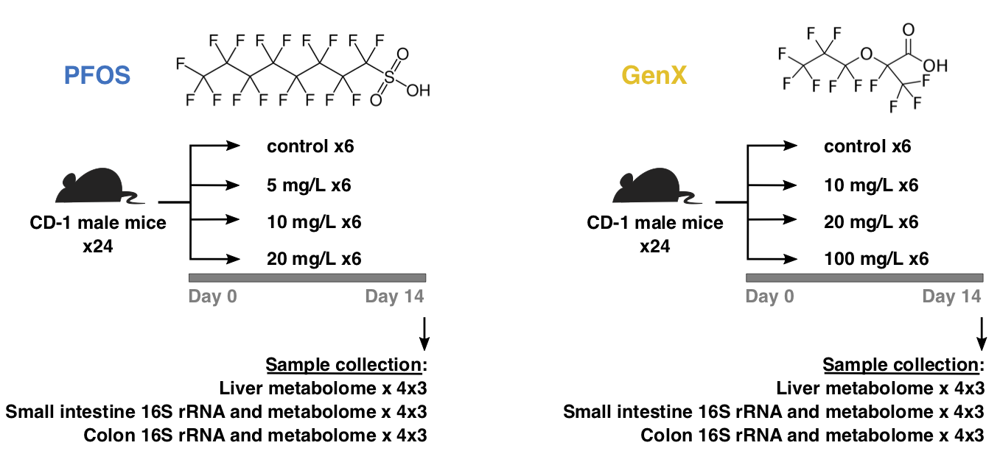

# The project contains files for the paper: Effect of sub acute exposure to PFOS and GenX on gut microbiota-host metabolome homeostasis in male mice.

- data: files with input data
- output: tables obtained during analysis
- graphs: plots obtained during analysis

microbiome.R processing scripts for 16S rRNA data analysis.

